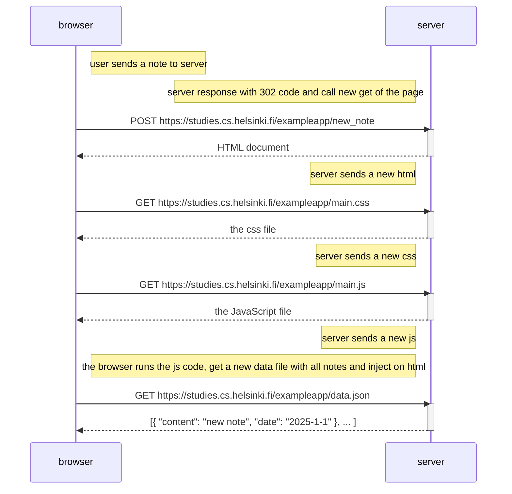

```mermaid
 sequenceDiagram
    participant browser
    participant server

    Note right of browser: user sends a note to server
    Note left of server: server response with 302 code and call new get of the page

    browser->>server: POST https://studies.cs.helsinki.fi/exampleapp/new_note
    activate server
    server-->>browser: HTML document
    deactivate server

    Note left of server: server sends a new html

    browser->>server: GET https://studies.cs.helsinki.fi/exampleapp/main.css
    activate server
    server-->>browser: the css file
    deactivate server

    Note left of server: server sends a new css

    browser->>server: GET https://studies.cs.helsinki.fi/exampleapp/main.js
    activate server
    server-->>browser: the JavaScript file
    deactivate server

    Note left of server: server sends a new js

    Note right of browser: the browser runs the js code, get a new data file with all notes and inject on html

    browser->>server: GET https://studies.cs.helsinki.fi/exampleapp/data.json
    activate server
    server-->>browser: [{ "content": "new note", "date": "2025-1-1" }, ... ]
    deactivate server
```
