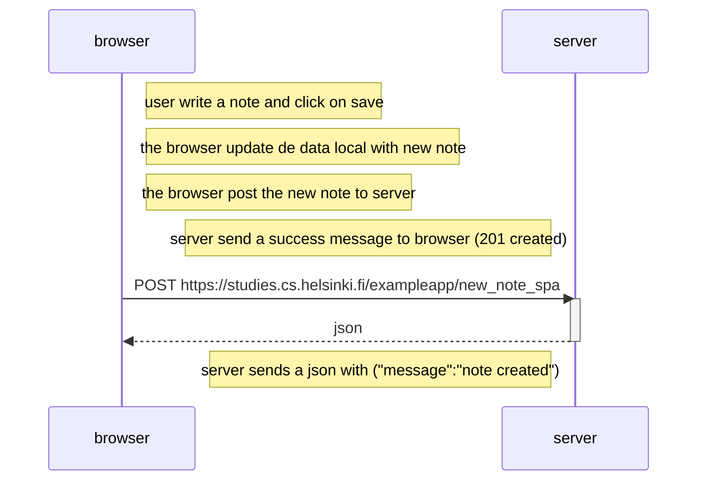

```mermaid
sequenceDiagram
    participant browser
    participant server

    Note right of browser: user write a note and click on save
    Note right of browser: the browser update de data local with new note
    Note right of browser: the browser post the new note to server
    Note left of server: server send a success message to browser (201 created)

    browser->>server: POST https://studies.cs.helsinki.fi/exampleapp/new_note_spa
    activate server
    server-->>browser: json
    deactivate server

    Note left of server: server sends a json with ("message":"note created")
```
